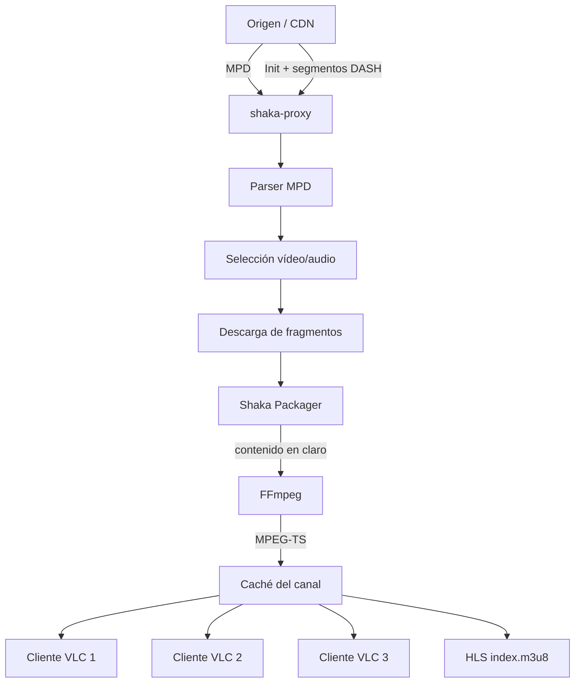

# shaka-proxy

**Proxy MPEG-DASH → MPEG-TS/HLS para convertir streams DASH, incluidos streams cifrados con CENC/ClearKey, en una salida que puede abrirse directamente con VLC, ffplay y otros clientes IPTV convencionales.**

`shaka-proxy` se coloca entre el origen DASH y el reproductor. Se encarga de seguir el manifiesto en directo, seleccionar las pistas de vídeo y audio, descargar los fragmentos necesarios, descifrarlos con **Shaka Packager** cuando se proporcionan claves ClearKey y remultiplexarlos con **FFmpeg** a MPEG-TS **sin recodificar**.

En la práctica, permite transformar esto:

```text
MPD + fragmentos DASH + ClearKey
```

en algo tan sencillo para el cliente como:

```text
http://servidor:8090/live/canal/stream.ts
```

o:

```text
http://servidor:8090/live/canal/index.m3u8
```

El reproductor final no necesita entender el MPD original, gestionar las claves ni conocer el funcionamiento interno de Shaka Packager.

> [!IMPORTANT]
> `shaka-proxy` no obtiene claves DRM, no solicita licencias DRM y no incluye mecanismos para extraer claves de servicios externos. Las claves que se utilicen deben ser proporcionadas por el usuario y emplearse únicamente con contenido para el que disponga de autorización.

---

## Índice

- [¿Qué hace exactamente?](#qué-hace-exactamente)
- [Características principales](#características-principales)
- [Arquitectura](#arquitectura)
- [Cómo funciona paso a paso](#cómo-funciona-paso-a-paso)
- [DASH, CENC y ClearKey explicado de forma sencilla](#dash-cenc-y-clearkey-explicado-de-forma-sencilla)
- [Integración con Shaka Packager](#integración-con-shaka-packager)
- [Remultiplexado con FFmpeg](#remultiplexado-con-ffmpeg)
- [Selección de vídeo y audio](#selección-de-vídeo-y-audio)
- [Productor compartido y varios clientes](#productor-compartido-y-varios-clientes)
- [Continuidad MPEG-TS por conexión](#continuidad-mpeg-ts-por-conexión)
- [Recuperación de segmentos y caché](#recuperación-de-segmentos-y-caché)
- [Acceso al origen, headers, proxy y egress](#acceso-al-origen-headers-proxy-y-egress)
- [Tokens dinámicos](#tokens-dinámicos)
- [Lista M3U de entrada](#lista-m3u-de-entrada)
- [Playlist M3U generada](#playlist-m3u-generada)
- [Salida MPEG-TS](#salida-mpeg-ts)
- [Salida HLS](#salida-hls)
- [EPG / XMLTV](#epg--xmltv)
- [Panel de estado](#panel-de-estado)
- [Gestión de sesiones](#gestión-de-sesiones)
- [Instalación](#instalación)
- [Configuración](#configuración)
- [Ejecución](#ejecución)
- [Varias instancias](#varias-instancias)
- [HTTPS y reverse proxy](#https-y-reverse-proxy)
- [Logs](#logs)
- [Pruebas](#pruebas)
- [Limitaciones actuales](#limitaciones-actuales)
- [Seguridad y uso responsable](#seguridad-y-uso-responsable)

---

# ¿Qué hace exactamente?

Muchos streams de televisión o vídeo en directo utilizan **MPEG-DASH**.

En lugar de enviar un único flujo continuo, el servidor publica:

- un manifiesto `.mpd`;
- un segmento de inicialización;
- muchos pequeños fragmentos de vídeo;
- muchos pequeños fragmentos de audio;
- diferentes calidades y representaciones;
- y, opcionalmente, contenido cifrado.

Un reproductor IPTV sencillo no siempre puede consumir directamente ese formato.

`shaka-proxy` hace de intermediario:

```text
Origen DASH
    │
    │  MPD + segmentos
    ▼
shaka-proxy
    │
    ├── analiza el MPD
    ├── selecciona vídeo y audio
    ├── descarga los fragmentos
    ├── aplica headers/tokens necesarios
    ├── descifra con Shaka Packager
    ├── remultiplexa con FFmpeg
    ├── mantiene una ventana de segmentos
    └── comparte el trabajo entre clientes
    │
    ▼
MPEG-TS / HLS
    │
    ▼
VLC / ffplay / cliente IPTV
```

Para el cliente final, toda esa complejidad desaparece.

VLC únicamente ve un stream MPEG-TS convencional.

---

# Características principales

- Conversión de **MPEG-DASH a MPEG-TS**.
- Salida directa mediante HTTP en `/live/<slug>/stream.ts`.
- Salida **HLS** en `/live/<slug>/index.m3u8`.
- Descifrado **CENC/ClearKey** mediante Shaka Packager.
- Soporte para contenido DASH sin cifrar.
- Remultiplexado con **FFmpeg sin transcodificación**.
- Selección automática de la mejor representación de vídeo.
- Límite de resolución configurable mediante `max_height`.
- Priorización de audio en español cuando el MPD utiliza `lang="spa"`.
- Soporte para H.264 y HEVC en el flujo de remux actual.
- Lectura de listas M3U.
- Soporte para `#KODIPROP:inputstream.adaptive.license_key`.
- ClearKey en varios formatos.
- Soporte para `#EXTVLCOPT:http-user-agent`.
- Soporte para `#EXTVLCOPT:http-referrer`.
- Headers adicionales mediante la sintaxis `URL|Header=Value`.
- Token `x-tcdn-token` recargable desde archivo.
- Reintentos ante errores temporales del CDN.
- Seguimiento periódico del MPD en streams en directo.
- Caché de segmentos de inicialización.
- Caché compartida de segmentos MPEG-TS ya preparados.
- Un único productor por canal para varios clientes.
- Continuidad MPEG-TS independiente por conexión HTTP.
- Recuperación ordenada de segmentos.
- Detección y salto controlado de segmentos que fallan repetidamente.
- Limpieza de sesiones inactivas.
- Límite configurable de canales activos.
- Playlist M3U final generada automáticamente.
- Passthrough de entradas no DASH.
- EPG mediante XMLTV y XMLTV comprimido con gzip.
- Panel web de estado.
- Endpoint de estado JSON.
- Visualización de clientes conectados.
- Soporte de `public_base` para reverse proxy y prefijos.
- Soporte para múltiples instancias mediante `PROXY_SHAKA_HOME`.
- Bind de tráfico de origen a una IP/interfaz concreta.
- DNS de egress configurable.
- Proxy HTTP/SOCKS configurable.
- Logs rotativos.
- Cierre limpio de productores, workers y sesiones.

---

# Arquitectura

La idea principal del proyecto es que **el procesamiento pertenece al canal, no al cliente**.



El trabajo pesado se realiza una vez por canal:

```text
                    ┌── VLC 1
DASH → Shaka → TS ──┼── VLC 2
                    └── VLC 3
```

y no una vez por cliente:

```text
VLC 1 → DASH → Shaka → FFmpeg
VLC 2 → DASH → Shaka → FFmpeg
VLC 3 → DASH → Shaka → FFmpeg
```

Esto permite que varios usuarios puedan consumir el mismo canal reutilizando los segmentos ya preparados.

---

# Cómo funciona paso a paso

Cuando un cliente abre un canal, el flujo general es:

```text
1. El cliente solicita /live/<slug>/stream.ts
                         │
                         ▼
2. shaka-proxy crea o reutiliza la sesión del canal
                         │
                         ▼
3. Obtiene el MPD actualizado
                         │
                         ▼
4. Analiza AdaptationSets y Representations
                         │
                         ▼
5. Selecciona vídeo y audio
                         │
                         ▼
6. Detecta los segmentos disponibles
                         │
                         ▼
7. Descarga init + fragmentos multimedia
                         │
                         ▼
8. Shaka Packager procesa/descifra cada pista
                         │
                         ▼
9. FFmpeg remultiplexa vídeo + audio a MPEG-TS
                         │
                         ▼
10. El segmento TS se publica en la caché del canal
                         │
                ┌────────┴────────┐
                ▼                 ▼
          stream.ts           HLS index
                │
                ▼
               VLC
```

El productor continúa actualizando el MPD y procesando nuevos fragmentos mientras el canal siga activo.

---

# DASH, CENC y ClearKey explicado de forma sencilla

## MPEG-DASH

En un stream tradicional podemos imaginar un flujo continuo:

```text
──────────────────────────────────────────────▶
```

DASH funciona de otra manera.

El contenido está dividido en pequeñas piezas:

```text
init.mp4
seg_100.m4s
seg_101.m4s
seg_102.m4s
seg_103.m4s
...
```

Vídeo y audio suelen tener sus propios fragmentos:

```text
VIDEO
├── init.mp4
├── 100.m4s
├── 101.m4s
└── 102.m4s

AUDIO
├── init.mp4
├── 300.m4s
├── 301.m4s
└── 302.m4s
```

El archivo `.mpd` describe dónde están esos fragmentos y cómo deben reproducirse.

## CENC

Los fragmentos pueden estar cifrados mediante **Common Encryption (CENC)**.

De forma simplificada:

```text
fragmento normal
      │
      ▼
   cifrado
      │
      ▼
fragmento que no puede reproducirse directamente
```

El MPD puede indicar el identificador de la clave utilizada mediante un `default_KID`.

## KID y KEY

El **KID** identifica una clave.

La **KEY** es la clave real.

```text
KID ─────────► identifica ─────────► KEY
```

Por ejemplo, conceptualmente:

```text
012345...abcd  →  abcdef...1234
      KID                KEY
```

`shaka-proxy` lee las claves proporcionadas en la M3U y se las entrega a Shaka Packager.

## El ejemplo de las cajas

Una forma sencilla de verlo es imaginar que cada fragmento DASH es una caja:

```text
📦🔒  📦🔒  📦🔒  📦🔒
```

El proxy descarga esas cajas y Shaka Packager utiliza la llave configurada:

```text
📦🔒 + 🔑
    │
    ▼
Shaka Packager
    │
    ▼
📦🔓
```

Después FFmpeg adapta el contenido resultante al formato de salida:

```text
vídeo claro ──┐
              ├── FFmpeg ──► MPEG-TS
audio claro ──┘
```

---

# Integración con Shaka Packager

Shaka Packager es la pieza encargada de procesar las pistas DASH.

`shaka-proxy` no implementa por sí mismo el descifrado CENC. En su lugar:

1. descarga el segmento de inicialización;
2. descarga el fragmento multimedia;
3. concatena ambos en un input temporal;
4. identifica las claves configuradas para el canal;
5. ejecuta Shaka Packager;
6. obtiene una pista MP4 procesada/descifrada;
7. entrega esa pista a FFmpeg.

El concepto es:

```text
init + media segment
       │
       ├── KID / KEY
       │
       ▼
 Shaka Packager
       │
       ▼
 pista en claro
```

Cuando existen claves, se construye internamente el argumento de raw keys que necesita Packager:

```text
label=k0:key_id=<KID>:key=<KEY>
label=k1:key_id=<KID>:key=<KEY>
...
```

y se utiliza el modo de descifrado mediante claves proporcionadas directamente:

```text
--enable_raw_key_decryption
--keys ...
```

Si el canal no tiene claves configuradas, Packager se ejecuta sin activar ese modo, por lo que el mismo pipeline también puede utilizarse con contenido DASH no cifrado.

## Formatos ClearKey aceptados

El parser acepta varias representaciones habituales.

### Formato KID:KEY

```m3u
#KODIPROP:inputstream.adaptive.license_key={00112233445566778899aabbccddeeff:ffeeddccbbaa99887766554433221100}
```

### Objeto JSON KID → KEY

```json
{
  "00112233445566778899aabbccddeeff": "ffeeddccbbaa99887766554433221100"
}
```

### JWK ClearKey

También puede interpretar una estructura JWK con claves en base64url:

```json
{
  "keys": [
    {
      "kty": "oct",
      "kid": "...",
      "k": "..."
    }
  ]
}
```

Internamente los valores se normalizan antes de entregarlos a Shaka Packager.

---

# Remultiplexado con FFmpeg

Después de Shaka Packager tenemos pistas de vídeo y audio procesadas, pero todavía necesitamos convertirlas en una salida cómoda para clientes IPTV.

FFmpeg se utiliza como **remultiplexador**.

La diferencia importante es que `shaka-proxy` intenta evitar una transcodificación:

```text
H.264  ───────────────► H.264
HEVC   ───────────────► HEVC
audio  ───────────────► mismo audio

       -c copy
```

Es decir, FFmpeg cambia la forma en la que se empaqueta el contenido, pero no vuelve a comprimir vídeo y audio.

Esto reduce:

- consumo de CPU;
- latencia;
- pérdida de calidad;
- carga innecesaria del servidor.

Para vídeo, el proxy selecciona el bitstream filter apropiado:

```text
H.264       → h264_mp4toannexb
hvc1 / hev1 → hevc_mp4toannexb
```

La salida final es MPEG Transport Stream.

---

# Conservación del reloj de audio y vídeo

Una parte importante del pipeline es mantener la relación temporal original entre las pistas.

Los fragmentos de audio y vídeo no siempre empiezan exactamente en el mismo instante. Normalizar cada fragmento de forma independiente puede provocar:

- pequeños saltos;
- drift;
- pérdida de sincronía;
- discontinuidades al unir segmentos.

El proxy conserva el reloj DASH común y remultiplexa utilizando timestamps originales.

Conceptualmente:

```text
reloj DASH de vídeo ──┐
                      ├──► mismo eje temporal ──► MPEG-TS
reloj DASH de audio ──┘
```

La salida utiliza `-copyts` y un offset común para mantener timestamps positivos sin perder la relación temporal entre las pistas.

---

# Selección de vídeo y audio

## Vídeo

El MPD puede ofrecer varias representaciones:

```text
576p  2 Mbit/s
720p  4 Mbit/s
1080p 6 Mbit/s
1080p 9 Mbit/s
```

`shaka-proxy` inspecciona las representaciones reales y las ordena por:

1. altura;
2. bitrate.

Cuando `max_height` es mayor que cero y existen representaciones dentro de ese límite, selecciona la de mayor calidad entre ellas.

Ejemplo:

```json
"max_height": 1080
```

El objetivo es escoger la mejor representación disponible hasta 1080p.

Con:

```json
"max_height": 0
```

no se aplica ese límite.

También se ignoran `AdaptationSet` que parecen destinados a I-frames/trick mode.

## Audio

El proxy busca los `AdaptationSet` de audio y actualmente:

1. prioriza una pista con `lang="spa"`;
2. comprueba, cuando existen claves, que el KID de la pista tenga una clave conocida;
3. si no hay audio `spa`, utiliza una pista alternativa disponible.

Actualmente la salida normal selecciona **una pista de audio**.

El idioma se escribe posteriormente como metadata en el MPEG-TS cuando puede representarse como código ISO-639.

---

# Productor compartido y varios clientes

Esta es una de las partes más importantes de la arquitectura.

Cada canal activo tiene una `ChannelSession`.

La sesión mantiene:

- estado del MPD;
- pista de vídeo seleccionada;
- pista de audio;
- posición del stream;
- segmentos ya publicados;
- workers;
- locks de segmentos;
- clientes;
- directorio HLS;
- secuencia HLS;
- estado de recuperación.

Cuando se conecta un segundo cliente al mismo canal, **no se crea otro pipeline completo**.

```text
                         ┌── Cliente A
                         │
DASH → Shaka → FFmpeg ───┼── Cliente B
          una vez         │
                         └── Cliente C
```

Los clientes reutilizan los segmentos procesados por el productor del canal.

Esto reduce el trabajo contra:

- el CDN;
- Shaka Packager;
- FFmpeg.

---

# Evitar trabajo duplicado

Cada timestamp de segmento dispone de sincronización propia.

Si dos partes del sistema solicitan el mismo segmento al mismo tiempo:

```text
Cliente/HLS ──┐
              ├──► mismo segmento
Productor ────┘
```

el lock asociado evita que ambos procesos generen el mismo `.ts` simultáneamente.

Una vez existe un segmento válido en caché, se reutiliza.

---

# Continuidad MPEG-TS por conexión

Los segmentos `.ts` pueden compartirse entre clientes, pero una conexión MPEG-TS continua necesita que sus **continuity counters** evolucionen correctamente.

Por eso cada conexión a:

```text
/live/<slug>/stream.ts
```

crea su propio estado `TSContinuity`.

El proxy recorre los paquetes MPEG-TS de 188 bytes y ajusta los contadores de continuidad por PID para esa conexión.

```text
caché compartida
      │
      ├──► Cliente 1 → continuity propia
      ├──► Cliente 2 → continuity propia
      └──► Cliente 3 → continuity propia
```

Los segmentos almacenados permanecen intactos y la adaptación se realiza al enviarlos a cada cliente.

Esto permite combinar:

- caché compartida;
- conexiones independientes;
- stream continuo hacia VLC.

---

# Entrega progresiva del MPEG-TS

`stream.ts` no concatena todo el contenido de golpe.

El proxy envía paquetes en bloques y acompasa la entrega utilizando la duración del segmento.

El objetivo es evitar entregar muchos segundos de contenido instantáneamente y después dejar al cliente esperando.

En términos simples:

```text
segmento preparado
       │
       ▼
envío progresivo por HTTP
       │
       ▼
      VLC
```

Además:

- la respuesta utiliza `Content-Type: video/mp2t`;
- se desactiva el buffering de reverse proxies compatibles mediante `X-Accel-Buffering: no`;
- se utiliza `Cache-Control: no-store, no-cache`;
- se permite CORS mediante `Access-Control-Allow-Origin: *`.

---

# Recuperación de segmentos y caché

El productor intenta seguir el borde del stream en directo.

Al arrancar una sesión nueva entra cerca del último segmento cerrado disponible.

A partir de ahí mantiene el orden de los fragmentos.

```text
... 100 101 102 103 104
                ▲
              arranque
```

Después:

```text
103 → 104 → 105 → 106 → ...
```

Si temporalmente falta un segmento, el productor intenta recuperarlo antes de continuar.

Si un fragmento falla repetidamente, `segment_failures_before_skip` determina cuántos fallos se toleran antes de marcarlo como saltado y seguir avanzando.

Esto evita que un único segmento imposible de obtener bloquee para siempre un canal en directo.

## MPD antiguos o inconsistentes

Un CDN puede devolver ocasionalmente una versión del MPD más antigua o una ventana más corta que la recibida anteriormente.

Los segmentos que ya han sido procesados y publicados se mantienen independientemente de la última fotografía del manifiesto mientras permanezcan dentro de la ventana activa.

Esto evita descartar inmediatamente contenido que ya estaba listo únicamente porque una actualización del MPD haya retrocedido temporalmente.

## Ventana HLS

El número de segmentos recientes conservados viene determinado por:

```json
"hls_window": 6
```

Los segmentos que abandonan esa ventana se eliminan del directorio de caché cuando dejan de ser necesarios.

El estado histórico asociado a segmentos antiguos también se poda para evitar un crecimiento indefinido durante sesiones largas.

---

# Segmentos de inicialización

Los `init` de vídeo y audio suelen repetirse en cada ciclo del stream.

`shaka-proxy` mantiene una pequeña caché de initialization segments para evitar descargarlos innecesariamente en cada fragmento.

```text
init.mp4 ──► caché
             │
             ├── segmento 100
             ├── segmento 101
             └── segmento 102
```

---

# Acceso al origen, headers, proxy y egress

Las peticiones al CDN pueden requerir más que una URL.

`shaka-proxy` puede añadir:

- User-Agent;
- Referer;
- Origin;
- headers personalizados;
- `x-tcdn-token`.

Las descargas del MPD y de los fragmentos utilizan actualmente `curl`, con:

- IPv4;
- HTTP/1.1;
- timeout;
- reintentos;
- redirects;
- `--path-as-is`;
- bind de interfaz/IP;
- proxy;
- resolución específica de host cuando se utiliza DNS de egress.

## User-Agent

Global:

```json
"default_ua": "Mozilla/5.0 Proxy-Shaka"
```

Por canal:

```m3u
#EXTVLCOPT:http-user-agent=Mozilla/5.0
```

## Referer

Global:

```json
"referer": "https://example.com/"
```

Por canal:

```m3u
#EXTVLCOPT:http-referrer=https://example.com/
```

## Origin

Puede definirse globalmente:

```json
"origin": "https://example.com"
```

## Headers directamente en la URL

También se admite:

```text
https://cdn.example.com/live/manifest.mpd|Header=Value|Otro-Header=OtroValor
```

Por ejemplo:

```text
https://cdn.example.com/live/manifest.mpd|Authorization=Bearer ejemplo
```

Mantén cualquier credencial real fuera del repositorio.

---

# Proxy y salida por una interfaz concreta

## `proxy_url`

Permite enviar las conexiones de origen a través de un proxy:

```json
"proxy_url": "socks5://127.0.0.1:1080"
```

Cuando no se utiliza `egress_bind`, el proxy se pasa a `curl`.

## `egress_bind`

Permite forzar el tráfico del CDN a salir utilizando una dirección local concreta:

```json
"egress_bind": "172.18.10.2"
```

Internamente se utiliza el equivalente a:

```text
curl --interface <IP>
```

Es útil en servidores con:

- varias interfaces;
- policy routing;
- WireGuard;
- túneles;
- múltiples salidas a Internet.

## `egress_dns`

Puede utilizarse junto con `egress_bind`:

```json
"egress_dns": "1.1.1.1"
```

El proxy realiza la consulta DNS desde la IP de egress y pasa el resultado a `curl` mediante resolución explícita del host.

Esto permite que tanto la resolución como la conexión utilicen el camino de red deseado.

> Si se configura `egress_bind`, esa ruta tiene prioridad sobre `proxy_url` en el acceso al CDN.

---

# Reintentos y recuperación del origen

Las peticiones al CDN cuentan con reintentos configurables:

```json
"cdn_retries": 3
```

Se reintentan errores de conexión y determinados fallos temporales.

La descarga individual de fragmentos también tolera respuestas como:

```text
404
425
429
500
502
503
```

durante un pequeño periodo, algo habitual cuando el MPD anuncia un fragmento ligeramente antes de que todos los nodos del CDN puedan servirlo.

El MPD se solicita además con un parámetro de cache-busting y, si esa petición falla, se vuelve a probar la URL original.

Los redirects HTTP relativos y absolutos se resuelven correctamente antes de continuar.

---

# Tokens dinámicos

Algunos orígenes utilizan un header como:

```text
x-tcdn-token
```

`shaka-proxy` permite mantener ese valor en un archivo separado.

Ejemplo de `token.json`:

```json
{
  "access_token": "TOKEN",
  "access_token_exp": 1770000000
}
```

La ruta se configura mediante:

```json
"token_file": "token.json"
```

El archivo se comprueba por fecha de modificación y se vuelve a leer cuando cambia.

Esto permite que un proceso externo renueve el token sin tener que reiniciar `shaka-proxy`.

```text
script externo
     │
     ▼
 token.json
     │
     ▼
shaka-proxy detecta el cambio
     │
     ▼
nuevas peticiones usan el nuevo token
```

Si el archivo no proporciona un token, puede utilizarse el `x-tcdn-token` incluido directamente entre los headers de la entrada M3U.

El proyecto **no implementa la obtención ni renovación específica de tokens de un proveedor**.

---

# Lista M3U de entrada

La lista se configura mediante:

```json
"source_m3u": "channels.m3u"
```

Ejemplo mínimo:

```m3u
#EXTM3U

#EXTINF:-1 tvg-id="canal-demo" tvg-name="Canal Demo",Canal Demo
https://example.invalid/live/manifest.mpd
```

Ejemplo con ClearKey:

```m3u
#EXTM3U

#EXTINF:-1 tvg-id="canal-demo" tvg-name="Canal Demo",Canal Demo
#KODIPROP:inputstream=inputstream.adaptive
#KODIPROP:inputstream.adaptive.manifest_type=mpd
#KODIPROP:inputstream.adaptive.license_type=clearkey
#KODIPROP:inputstream.adaptive.license_key={00112233445566778899aabbccddeeff:ffeeddccbbaa99887766554433221100}
https://example.invalid/live/manifest.mpd
```

Las líneas habituales de Kodi/InputStream Adaptive pueden permanecer en la lista.

La propiedad que `shaka-proxy` utiliza para obtener las claves es:

```text
#KODIPROP:inputstream.adaptive.license_key=
```

Las directivas `#KODIPROP` no se envían posteriormente a VLC.

## Headers por canal

```m3u
#EXTINF:-1,Canal Demo
#EXTVLCOPT:http-user-agent=Mozilla/5.0
#EXTVLCOPT:http-referrer=https://example.invalid/
https://example.invalid/live/manifest.mpd|X-Test=example
```

## Slugs

El nombre del canal se transforma automáticamente en un slug válido.

```text
La 1 HD
   ↓
la-1-hd
```

Por tanto:

```text
/live/la-1-hd/stream.ts
```

Si dos canales generan el mismo slug, se añaden sufijos para mantenerlos únicos.

---

# Recarga automática de la M3U

La lista no queda congelada para siempre al iniciar el proceso.

`shaka-proxy` comprueba la fecha de modificación de `channels.m3u` y la vuelve a parsear cuando cambia.

Esto permite editar la lista sin reiniciar necesariamente el servicio para que los endpoints de playlist/estado recojan la nueva configuración.

---

# Playlist M3U generada

El endpoint:

```text
/playlist.m3u8
```

genera una lista preparada para clientes.

Por cada entrada DASH:

```text
https://cdn.example.com/manifest.mpd
```

se publica una URL local:

```text
/live/<slug>/stream.ts
```

Las entradas que no son DASH se mantienen como passthrough y conservan su URL original.

Ejemplo:

```text
channels.m3u
     │
     ▼
shaka-proxy
     │
     ▼
/playlist.m3u8
     │
     ├── Canal DASH → /live/canal/stream.ts
     └── Canal normal → URL original
```

Esto permite utilizar una única playlist que mezcle canales procesados y URLs que no necesitan pasar por Shaka.

---

# Salida MPEG-TS

Endpoint:

```text
/live/<slug>/stream.ts
```

Ejemplo:

```bash
vlc http://127.0.0.1:8090/live/canal-demo/stream.ts
```

o:

```bash
ffplay http://127.0.0.1:8090/live/canal-demo/stream.ts
```

Esta salida es una conexión HTTP continua.

El cliente no necesita conocer:

- el MPD;
- los fragmentos `.m4s`;
- el KID;
- la KEY;
- Shaka Packager;
- la URL real del CDN.

Solo recibe MPEG-TS.

---

# Salida HLS

Cada canal DASH también publica:

```text
/live/<slug>/index.m3u8
```

Ejemplo:

```bash
vlc http://127.0.0.1:8090/live/canal-demo/index.m3u8
```

El índice referencia los segmentos generados:

```text
/live/<slug>/seg_<timestamp>.ts
```

La playlist HLS utiliza:

- `#EXT-X-VERSION:3`;
- `#EXT-X-TARGETDURATION`;
- `#EXT-X-MEDIA-SEQUENCE`;
- `#EXTINF`.

Antes de entregar el índice, el proxy espera a disponer de varios segmentos listos siempre que sea posible para proporcionar un arranque más estable.

Los segmentos HLS se sirven con CORS habilitado.

---

# EPG / XMLTV

La cabecera de la M3U puede declarar una guía:

```m3u
#EXTM3U url-tvg="https://example.com/epg.xml"
```

También se soporta XMLTV comprimido:

```m3u
#EXTM3U url-tvg="https://example.com/epg.xml.gz"
```

El proxy:

1. descarga la guía;
2. detecta gzip por extensión o cabecera;
3. relaciona los canales usando `tvg-id` y nombre;
4. ignora canales de la guía que no existen en la M3U;
5. conserva la programación relevante;
6. expone una interfaz web en `/epg`.

La coincidencia de nombres elimina diferencias simples como:

- mayúsculas/minúsculas;
- acentos;
- espacios;
- signos.

El EPG mantiene la programación relevante de las próximas horas y muestra la hora en la zona `Europe/Madrid`.

La guía se mantiene en memoria y se actualiza periódicamente.

---

# Panel de estado

Endpoint:

```text
/status
```

muestra una interfaz web con información del servicio.

Entre otros datos puede mostrar:

- canales cargados;
- sesiones abiertas;
- canales activos;
- tiempo activo;
- tiempo inactivo;
- número de espectadores;
- clientes conectados;
- IP del cliente;
- User-Agent;
- tiempo conectado;
- número de segmentos en caché;
- estado del productor;
- resolución;
- framerate;
- calidad;
- estado del token;
- tiempo restante del token cuando existe fecha de expiración.

El estado se actualiza desde el navegador sin necesidad de recargar manualmente la página.

También existe la versión JSON:

```text
/status.json
```

útil para:

- monitorización;
- scripts;
- dashboards;
- integraciones externas.

---

# Gestión de sesiones

Los canales se crean bajo demanda.

Abrir:

```text
/live/canal/stream.ts
```

crea una `ChannelSession` si todavía no existe.

Si ya existe, se reutiliza.

## Límite de canales

```json
"max_channels": 8
```

limita el número de sesiones de canal simultáneas.

Si se alcanza el límite:

- se intenta liberar primero la sesión inactiva más antigua;
- si todas están siendo utilizadas, se devuelve temporalmente `503 Service Unavailable`.

## Liberación de canales inactivos

```json
"idle_seconds": 45
```

indica cuánto tiempo puede permanecer una sesión sin espectadores/clientes antes de ser eliminada.

Un reaper revisa periódicamente las sesiones.

Al liberar un canal:

- se cancela el productor;
- se cancelan workers;
- se limpia la caché;
- se elimina el directorio temporal del canal.

---

# Cambios de representación

Si una actualización del MPD hace que cambie:

- la representación de vídeo;
- o la representación de audio;

la sesión incrementa su generación y limpia los segmentos de la generación anterior.

También reinicia el origen temporal necesario para el nuevo pipeline.

Esto evita mezclar en una misma salida segmentos generados con configuraciones de pista incompatibles.

Los clientes de `stream.ts` pueden reconectar limpiamente cuando cambia la generación del canal.

---

# Instalación

## Requisitos

Se necesita:

- Python **3.11+**;
- `curl`;
- FFmpeg;
- Shaka Packager;
- compilador C;
- cabeceras de desarrollo de Python;
- dependencias de `requirements.txt`.

Shaka Packager **no se distribuye en este repositorio**.

Puedes colocarlo en:

```text
bin/packager
```

o indicar una ruta absoluta en `config.json`.

Comprueba las dependencias principales:

```bash
python3 --version
curl --version
ffmpeg -version
bin/packager --version
```

## Clonar

```bash
git clone https://github.com/mateodd1/shaka-proxy.git
cd shaka-proxy
```

## Entorno virtual

```bash
python3 -m venv .venv
```

## Compilar e instalar

El proyecto incluye `build.sh`:

```bash
./build.sh
```

El script:

1. instala `requirements.txt`;
2. compila `src/proxy.py` mediante Cython;
3. instala el módulo `proxy` en el entorno virtual.

Después crea tus archivos locales:

```bash
cp config.example.json config.json
cp channels.example.m3u channels.m3u
```

Edita ambos antes de iniciar el servicio.

> No subas a Git `config.json`, `channels.m3u`, `token.json`, claves, cookies ni credenciales reales.

---

# Configuración

Ejemplo actual:

```json
{
  "listen_host": "127.0.0.1",
  "listen_port": 8090,
  "public_base": "",

  "source_m3u": "channels.m3u",
  "token_file": "token.json",
  "proxy_url": "",

  "egress_bind": "",
  "egress_dns": "",
  "referer": "",
  "origin": "",

  "default_ua": "Mozilla/5.0 Proxy-Shaka",
  "max_height": 1080,

  "idle_seconds": 45,
  "max_channels": 8,
  "origin_concurrency": 4,

  "cdn_retries": 3,
  "remux_timeout": 20,
  "segment_failures_before_skip": 2,

  "hls_window": 6,

  "ffmpeg": "/usr/bin/ffmpeg",
  "packager": "bin/packager",

  "hls_dir": "hls",
  "log_dir": "logs"
}
```

## Referencia de opciones

| Opción | Descripción |
| --- | --- |
| `listen_host` | Dirección en la que escucha el servidor HTTP. |
| `listen_port` | Puerto HTTP del servicio. |
| `public_base` | URL pública utilizada al generar URLs de salida. |
| `source_m3u` | Ruta a la playlist M3U de entrada. |
| `token_file` | Archivo opcional con `access_token` y expiración. |
| `proxy_url` | Proxy opcional para acceder al origen. |
| `egress_bind` | IP local por la que se fuerza la salida hacia el CDN. |
| `egress_dns` | Resolver DNS utilizado con el egress configurado. |
| `referer` | Referer global enviado al origen. |
| `origin` | Header Origin global. |
| `default_ua` | User-Agent por defecto. |
| `max_height` | Altura máxima preferida al seleccionar vídeo. `0` desactiva el límite. |
| `idle_seconds` | Tiempo de inactividad antes de liberar una sesión sin clientes. |
| `max_channels` | Máximo de sesiones de canal simultáneas. |
| `origin_concurrency` | Límite de trabajo simultáneo contra el origen. |
| `cdn_retries` | Número de intentos de las peticiones al CDN. |
| `remux_timeout` | Timeout del proceso de remultiplexado. |
| `segment_failures_before_skip` | Fallos consecutivos permitidos antes de saltar un fragmento. |
| `hls_window` | Número de segmentos recientes mantenidos en la ventana HLS. |
| `ffmpeg` | Ruta al ejecutable de FFmpeg. |
| `packager` | Ruta al ejecutable de Shaka Packager. |
| `hls_dir` | Directorio de trabajo/caché HLS. |
| `log_dir` | Directorio de logs. |

Las rutas relativas de:

```text
source_m3u
token_file
packager
hls_dir
log_dir
```

se resuelven respecto a `PROXY_SHAKA_HOME`.

---

# Ejecución

Desde la raíz:

```bash
PROXY_SHAKA_HOME="$PWD" .venv/bin/python run.py
```

Con la configuración de ejemplo:

```text
http://127.0.0.1:8090/
```

Endpoints principales:

| Endpoint | Función |
| --- | --- |
| `/playlist.m3u8` | Playlist final preparada para clientes. |
| `/live/<slug>/stream.ts` | Stream MPEG-TS continuo. |
| `/live/<slug>/index.m3u8` | Playlist HLS del canal. |
| `/live/<slug>/seg_<t>.ts` | Segmento MPEG-TS HLS. |
| `/status` | Panel web de estado. |
| `/status.json` | Estado en JSON. |
| `/epg` | Guía de programación web. |

Para abrir la lista completa en VLC:

```bash
vlc http://127.0.0.1:8090/playlist.m3u8
```

---

# `public_base`

Si el servicio se publica detrás de un dominio:

```json
"public_base": "https://tv.example.com"
```

la playlist generará:

```text
https://tv.example.com/live/canal/stream.ts
```

También puede incluir un prefijo:

```json
"public_base": "https://example.com/proxy1"
```

generando:

```text
https://example.com/proxy1/live/canal/stream.ts
```

Esto facilita publicar varias instancias detrás de un mismo reverse proxy.

---

# Varias instancias

`PROXY_SHAKA_HOME` permite utilizar el mismo código con varios directorios de configuración.

Ejemplo conceptual:

```text
/opt/shaka-proxy/
    código compartido

/etc/shaka-proxy/instance1/
    config.json
    channels.m3u
    token.json
    hls/
    logs/

/etc/shaka-proxy/instance2/
    config.json
    channels.m3u
    token.json
    hls/
    logs/
```

Cada instancia debe disponer de:

- `listen_port` diferente;
- directorio HLS propio;
- logs propios;
- configuración propia;
- playlist propia;
- token propio cuando corresponda;
- `public_base` apropiado.

El directorio `deploy/` incluye ejemplos para desplegar instancias con systemd y reverse proxies.

---

# HTTPS y reverse proxy

`shaka-proxy` puede escuchar únicamente en localhost:

```json
"listen_host": "127.0.0.1"
```

y publicarse detrás de:

- Caddy;
- Nginx;
- otro reverse proxy.

Ejemplo conceptual:

```text
Internet
   │
 HTTPS
   ▼
Caddy / Nginx
   │
 HTTP local
   ▼
shaka-proxy :8090
```

Cuando se utiliza un prefijo externo, recuerda reflejarlo en `public_base`.

Para `stream.ts`, conviene que el reverse proxy no introduzca buffering agresivo. El propio backend envía:

```text
X-Accel-Buffering: no
```

para proxies compatibles.

---

# Logs

Los logs se escriben en:

```text
<log_dir>/proxy-shaka.log
```

El fichero utiliza rotación automática:

- tamaño máximo aproximado: 5 MiB;
- 3 copias históricas.

Entre otras cosas se registran:

- inicio de productores;
- cambios de pistas;
- clientes que conectan/desconectan;
- reintentos del CDN;
- fallos de segmentos;
- segmentos saltados;
- problemas de Shaka;
- errores de FFmpeg;
- gaps;
- stalls;
- liberación de sesiones.

---

# Robustez del pipeline

El proyecto incluye varias protecciones pensadas para streams en directo.

## Cancelación de subprocesses

Si una tarea que ejecuta Shaka o FFmpeg:

- expira;
- se cancela;
- falla;

el subprocess se termina y se espera su cierre para evitar procesos huérfanos.

## Descargas agrupadas

Cuando se descargan varias piezas relacionadas y una de ellas falla, las tareas hermanas pendientes se cancelan para no dejar trabajo innecesario ejecutándose.

## Directorios temporales por segmento

Cada fragmento se procesa dentro de:

```text
.tmp-<timestamp>
```

y se elimina al terminar o fallar.

El `.ts` definitivo solo se publica después de completar correctamente el pipeline.

## Publicación atómica

El resultado temporal se mueve al nombre final una vez que FFmpeg ha terminado satisfactoriamente.

Esto reduce la posibilidad de que otro cliente vea un segmento parcialmente escrito.

## Cierre limpio

Durante el shutdown:

1. se detiene el reaper;
2. se cancelan productores;
3. se esperan workers;
4. se eliminan sesiones;
5. se limpia la caché HLS;
6. se cierra el acceso al origen.

---

# Flujo detallado de un segmento

Un fragmento individual sigue aproximadamente este camino:

```text
             MPD
              │
              ▼
    timestamp de vídeo T
              │
              ▼
   construir URL del vídeo
              │
              ├────────────────────────────┐
              ▼                            ▼
      descargar video init         localizar audio
              │                            │
              ▼                            ▼
      descargar video seg          descargar audio init
                                           │
                                           ▼
                                  descargar audio seg
              │                            │
              └────────────┬───────────────┘
                           ▼
                  archivos temporales
                           │
                           ▼
                 Shaka Packager
                           │
                 vídeo/audio en claro
                           │
                           ▼
                       FFmpeg
                           │
                       -c copy
                           │
                           ▼
                    seg_<T>.ts
                           │
              ┌────────────┴─────────────┐
              ▼                          ▼
        stream.ts                      HLS
```

---

# ¿Por qué Shaka Packager + FFmpeg?

Las dos herramientas tienen responsabilidades diferentes.

## Shaka Packager

Se ocupa de entender y procesar correctamente el contenido DASH/fMP4 y de aplicar raw-key decryption cuando existen claves.

```text
DASH cifrado
     │
     ▼
Shaka Packager
     │
     ▼
pista en claro
```

## FFmpeg

Se ocupa de convertir las pistas resultantes en un transporte compatible con los clientes finales.

```text
vídeo + audio
     │
     ▼
   FFmpeg
     │
     ▼
 MPEG-TS
```

## shaka-proxy

Coordina todo lo demás:

```text
M3U
MPD
selección de pistas
headers
tokens
CDN
reintentos
segmentos
caché
clientes
HLS
estado
EPG
```

---

# ¿Qué ve VLC?

Nada de la complejidad anterior.

```text
VLC
 │
 │ GET /live/canal/stream.ts
 ▼
shaka-proxy
 │
 │ video/mp2t
 ▼
VLC reproduce
```

VLC no necesita:

- soporte ClearKey específico;
- leer la `license_key`;
- lanzar Shaka;
- descargar el MPD;
- seguir el `SegmentTimeline`;
- unir initialization segments;
- conocer las URLs originales.

---

# Pruebas

Para probar directamente el código fuente:

```bash
PYTHONPATH=src .venv/bin/python -m unittest discover -s tests -v
```

Para probar el módulo compilado instalado:

```bash
.venv/bin/python -m unittest discover -s tests -v
```

La suite incluye pruebas de lógica del proxy.

Las pruebas multimedia generan su propio contenido de vídeo/audio y pueden omitirse cuando faltan los binarios externos necesarios.

Las pruebas de EPG utilizan datos ficticios y no necesitan depender de una guía real.

---

# Limitaciones actuales

`shaka-proxy` está diseñado alrededor del tipo de MPEG-DASH utilizado por los streams para los que se desarrolló. No pretende ser una implementación completa de toda la especificación DASH.

Actualmente conviene tener en cuenta:

- el parser está centrado principalmente en `SegmentTemplate` + `SegmentTimeline`;
- el flujo actual utiliza timestamps `$Time$`;
- la selección normal de audio termina utilizando una sola pista;
- se prioriza específicamente `lang="spa"`;
- el remux de vídeo está orientado a H.264/HEVC;
- el proyecto no realiza transcodificación;
- no implementa un cliente de licencias DRM;
- no obtiene claves;
- no renueva tokens específicos de proveedores;
- Shaka Packager y FFmpeg son dependencias externas;
- la salida en directo está pensada principalmente para MPEG-TS/HLS.

Si un MPD utiliza una estructura muy diferente, puede ser necesario ampliar el parser.

---

# Seguridad y uso responsable

No publiques en Git:

```text
config.json
channels.m3u reales
token.json
cookies
tokens
credenciales
claves ClearKey
URLs privadas
```

Utiliza:

```text
config.example.json
channels.example.m3u
```

para mostrar configuraciones ficticias.

Las claves, tokens y credenciales deben mantenerse fuera del control de versiones.

`shaka-proxy` es una herramienta de procesamiento y adaptación multimedia. El usuario es responsable de disponer de los permisos necesarios para acceder, descifrar, procesar y redistribuir cualquier contenido utilizado.

El proyecto:

- no proporciona claves;
- no extrae claves;
- no solicita licencias DRM;
- no incluye credenciales;
- no incluye listas privadas;
- no implementa sistemas de obtención de cuentas o tokens de proveedores.

---

# Resumen

La idea de `shaka-proxy` puede resumirse en una línea:

```text
DASH → descargar → Shaka Packager → FFmpeg → MPEG-TS/HLS → VLC
```

Y para contenido CENC/ClearKey:

```text
DASH cifrado + claves proporcionadas por el usuario
                         │
                         ▼
                  Shaka Packager
                         │
                         ▼
                 contenido en claro
                         │
                         ▼
                      FFmpeg
                         │
                         ▼
                    MPEG-TS/HLS
                         │
                         ▼
                VLC / cliente IPTV
```

El objetivo es que toda la complejidad del origen quede encapsulada en el servidor y que el cliente final solo tenga que abrir una URL convencional.
